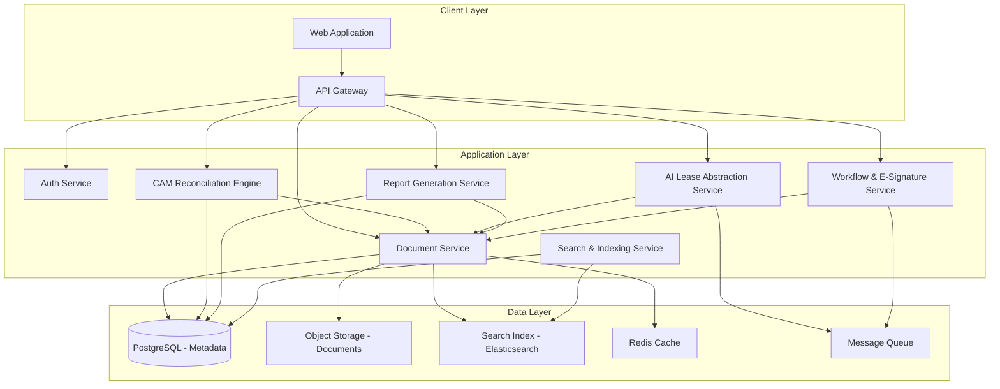
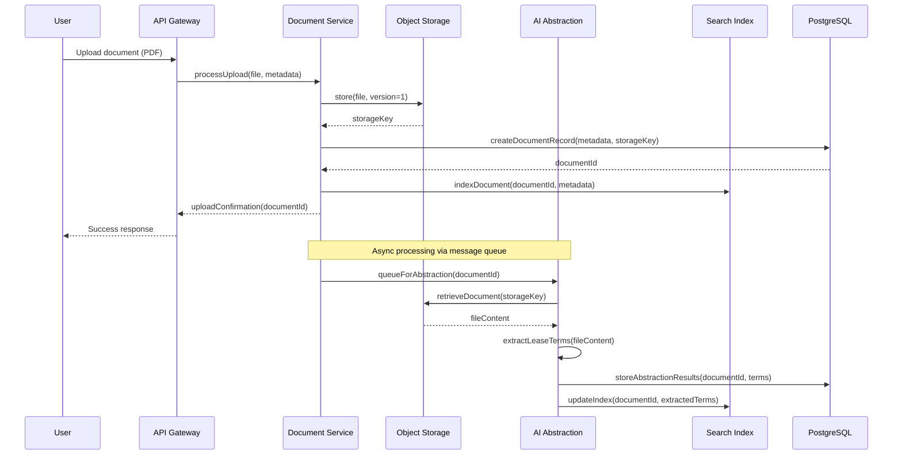
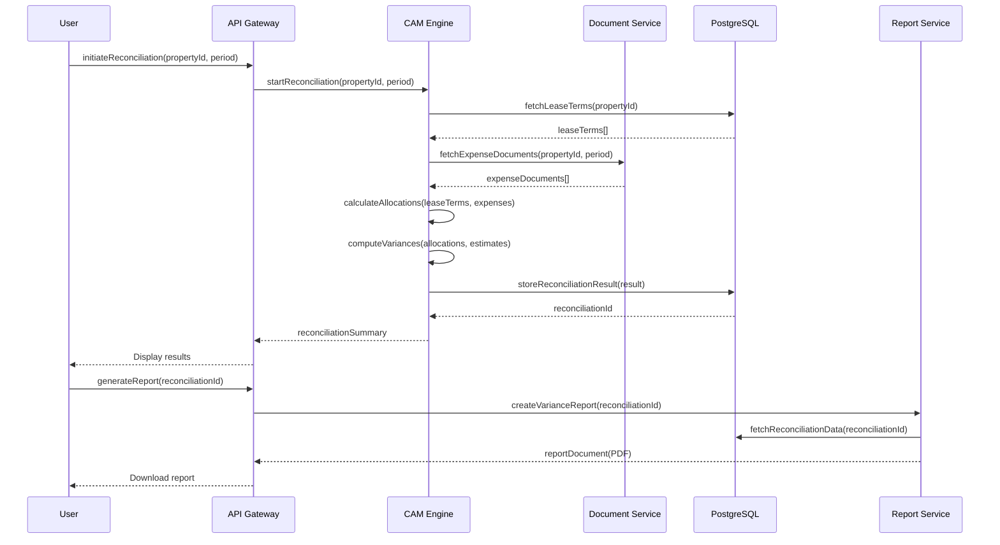
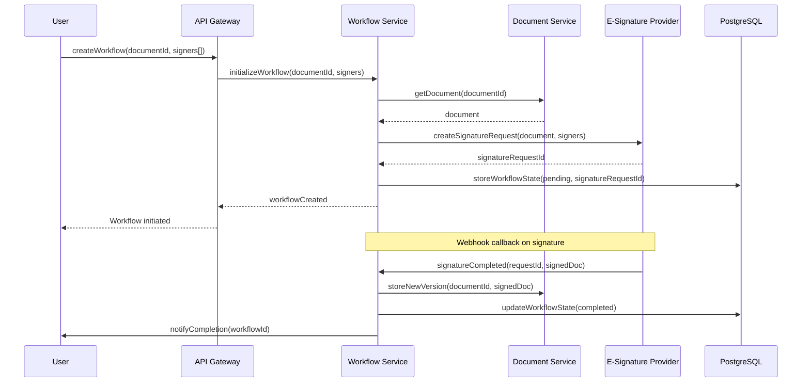

# Design Document: Property Document Platform

## Overview

The Property Document Platform is a centralized, secure system for managing property management documents with intelligent automation capabilities. It replaces manual, spreadsheet-driven workflows with automated CAM reconciliation, AI-powered lease abstraction, and professional report generation.

The platform targets mid-market property management firms that need more automation than basic document managers (like STRATAFOLIO) but find enterprise systems (like Yardi) overly complex and expensive. It provides a clean, intuitive interface for organizing documents across properties and tenants, with full version history, audit trails, and workflow automation including e-signature integration.

The core value proposition centers on three automation pillars: (1) reducing CAM reconciliation from days to minutes, (2) automatically extracting key lease terms from PDFs, and (3) generating professional, audit-ready reports on demand.ass

## Architecture



## Sequence Diagrams

### Document Upload and Processing Flow



### CAM Reconciliation Flow



### Workflow and E-Signature Flow



## Components and Interfaces

### Component 1: Document Service

**Purpose**: Manages the full lifecycle of documents including upload, versioning, retrieval, and deletion with complete audit trails.

**Responsibilities**:
- Store and retrieve documents with version control
- Maintain document metadata and relationships
- Enforce access control at the document level
- Trigger async processing pipelines (AI abstraction, indexing)
- Maintain audit trail for all document operations

### Component 2: CAM Reconciliation Engine

**Purpose**: Automates Common Area Maintenance charge reconciliation by computing tenant allocations, comparing actuals to estimates, and identifying variances.

**Responsibilities**:
- Calculate pro-rata share allocations based on lease terms
- Aggregate actual expenses by category and period
- Compute variances between estimated and actual charges
- Support multiple allocation methods (square footage, fixed percentage, custom)
- Generate reconciliation summaries with line-item detail

### Component 3: AI Lease Abstraction Service

**Purpose**: Automatically extracts structured data from lease PDF documents using AI/ML, identifying key terms, dates, financial obligations, and clauses.

**Responsibilities**:
- Parse PDF documents and extract text content
- Identify and extract key lease terms (rent, escalations, options, CAM caps)
- Classify lease clauses and provisions
- Provide confidence scores for extracted data
- Support human review and correction of extracted terms

### Component 4: Report Generation Service

**Purpose**: Produces professional, audit-ready documents including tenant statements, variance reports, and reconciliation packages.

**Responsibilities**:
- Generate tenant statements with charge breakdowns
- Create variance reports comparing estimates to actuals
- Produce audit-ready reconciliation packages
- Support multiple output formats (PDF, Excel)
- Apply configurable templates and branding

### Component 5: Workflow & E-Signature Service

**Purpose**: Manages document approval workflows and integrates with external e-signature providers for legally binding document execution.

**Responsibilities**:
- Define and execute multi-step approval workflows
- Integrate with e-signature providers (DocuSign, HelloSign)
- Track workflow state and notify participants
- Store signed documents as new versions
- Maintain signature audit trail

### Component 6: Search & Indexing Service

**Purpose**: Provides fast, full-text and structured search across all documents, properties, tenants, and extracted lease terms.

**Responsibilities**:
- Index document content and metadata
- Support full-text search with relevance ranking
- Provide faceted search by property, tenant, document type, date
- Index extracted lease terms for structured queries
- Support saved searches and alerts

## Data Models

### Property

| Field | Type | Description |
|-------|------|-------------|
| id | UUID | Unique identifier |
| name | String | Property name |
| address | Address | Physical address |
| totalSquareFootage | Nat | Total leasable area in sq ft |
| propertyType | PropertyType | Commercial, Retail, Industrial, Mixed |
| ownerId | UUID | Reference to owner/organization |
| createdAt | DateTime | Creation timestamp |
| updatedAt | DateTime | Last modification timestamp |

### Tenant

| Field | Type | Description |
|-------|------|-------------|
| id | UUID | Unique identifier |
| name | String | Tenant/company name |
| contactEmail | String | Primary contact email |
| propertyId | UUID | Associated property |
| leaseId | UUID | Active lease reference |
| suiteNumber | String | Unit/suite identifier |
| squareFootage | Nat | Leased area in sq ft |
| status | TenantStatus | Active, Inactive, Pending |

### Document

| Field | Type | Description |
|-------|------|-------------|
| id | UUID | Unique identifier |
| title | String | Document title |
| documentType | DocumentType | Lease, Invoice, Report, Correspondence |
| propertyId | UUID | Associated property |
| tenantId | Option UUID | Associated tenant (if applicable) |
| storageKey | String | Object storage reference |
| currentVersion | Nat | Current version number |
| mimeType | String | File MIME type |
| sizeBytes | Nat | File size |
| uploadedBy | UUID | User who uploaded |
| createdAt | DateTime | Upload timestamp |
| updatedAt | DateTime | Last modification |

### LeaseAbstraction

| Field | Type | Description |
|-------|------|-------------|
| id | UUID | Unique identifier |
| documentId | UUID | Source lease document |
| tenantId | UUID | Associated tenant |
| commencementDate | Date | Lease start date |
| expirationDate | Date | Lease end date |
| baseRent | Money | Monthly base rent |
| rentEscalation | EscalationType | Annual increase terms |
| camCap | Option Money | CAM expense cap if applicable |
| securityDeposit | Money | Security deposit amount |
| renewalOptions | List RenewalOption | Renewal terms |
| extractedTerms | List ExtractedTerm | All extracted key-value pairs |
| confidenceScore | Float | Overall extraction confidence |
| reviewStatus | ReviewStatus | Pending, Approved, NeedsCorrection |

### CAMReconciliation

| Field | Type | Description |
|-------|------|-------------|
| id | UUID | Unique identifier |
| propertyId | UUID | Property being reconciled |
| periodStart | Date | Reconciliation period start |
| periodEnd | Date | Reconciliation period end |
| totalExpenses | Money | Total actual CAM expenses |
| lineItems | List CAMLineItem | Expense line items |
| tenantAllocations | List TenantAllocation | Per-tenant allocations |
| status | ReconciliationStatus | Draft, InProgress, Completed, Approved |
| createdBy | UUID | User who initiated |
| completedAt | Option DateTime | Completion timestamp |

**Validation Rules**:
- periodEnd must be after periodStart
- totalExpenses must equal sum of lineItems amounts
- Sum of tenantAllocations percentages must equal 100%
- All referenced tenants must have active leases in the property during the period

## Algorithmic Pseudocode

### CAM Allocation Algorithm

```lean
/-- A monetary amount represented as cents to avoid floating point issues -/
structure Money where
  cents : Int
  deriving Repr, BEq

/-- A tenant's share allocation for CAM expenses -/
structure TenantAllocation where
  tenantId : String
  squareFootage : Nat
  sharePercentage : Float
  estimatedAmount : Money
  actualAmount : Money
  variance : Money
  deriving Repr

/-- A line item in CAM expenses -/
structure CAMLineItem where
  category : String
  description : String
  amount : Money
  deriving Repr

/-- Configuration for a CAM reconciliation -/
structure ReconciliationConfig where
  propertyId : String
  totalLeasableArea : Nat
  periodStart : String
  periodEnd : String
  deriving Repr

/-- Tenant lease information relevant to CAM -/
structure TenantLease where
  tenantId : String
  squareFootage : Nat
  camCap : Option Money
  estimatedCAM : Money
  deriving Repr

/-- Result of a CAM reconciliation -/
structure ReconciliationResult where
  totalExpenses : Money
  allocations : List TenantAllocation
  isBalanced : Bool
  deriving Repr

/-- Calculate pro-rata share percentage based on square footage -/
def calculateProRataShare (tenantSqFt : Nat) (totalSqFt : Nat) : Float :=
  if totalSqFt == 0 then 0.0
  else (Float.ofNat tenantSqFt) / (Float.ofNat totalSqFt)

/-- Apply CAM cap if one exists in the lease -/
def applyCAMCap (actualAmount : Money) (cap : Option Money) : Money :=
  match cap with
  | none => actualAmount
  | some capAmount =>
    if actualAmount.cents > capAmount.cents then capAmount
    else actualAmount

/-- Calculate a single tenant's allocation -/
def calculateTenantAllocation
    (tenant : TenantLease)
    (totalExpenses : Money)
    (totalSqFt : Nat) : TenantAllocation :=
  let sharePercent := calculateProRataShare tenant.squareFootage totalSqFt
  let rawAllocation : Money := ⟨Int.ofFloat (sharePercent * Float.ofInt totalExpenses.cents)⟩
  let cappedAllocation := applyCAMCap rawAllocation tenant.camCap
  let variance : Money := ⟨cappedAllocation.cents - tenant.estimatedCAM.cents⟩
  { tenantId := tenant.tenantId
  , squareFootage := tenant.squareFootage
  , sharePercentage := sharePercent
  , estimatedAmount := tenant.estimatedCAM
  , actualAmount := cappedAllocation
  , variance := variance }

/-- Sum all line item amounts -/
def sumLineItems (items : List CAMLineItem) : Money :=
  items.foldl (fun acc item => ⟨acc.cents + item.amount.cents⟩) ⟨0⟩

/-- Perform full CAM reconciliation for a property -/
def reconcile
    (config : ReconciliationConfig)
    (lineItems : List CAMLineItem)
    (tenants : List TenantLease) : ReconciliationResult :=
  let totalExpenses := sumLineItems lineItems
  let allocations := tenants.map fun t =>
    calculateTenantAllocation t totalExpenses config.totalLeasableArea
  let allocatedTotal := allocations.foldl (fun acc a => ⟨acc.cents + a.actualAmount.cents⟩) ⟨0⟩
  let isBalanced := allocatedTotal.cents == totalExpenses.cents
  { totalExpenses := totalExpenses
  , allocations := allocations
  , isBalanced := isBalanced }
```

### Document Version Control Algorithm

```lean
/-- Represents a single version of a document -/
structure DocumentVersion where
  versionNumber : Nat
  storageKey : String
  uploadedBy : String
  uploadedAt : String
  changeDescription : String
  sizeBytes : Nat
  checksum : String
  deriving Repr

/-- Audit trail entry for document operations -/
inductive AuditAction where
  | created
  | viewed
  | downloaded
  | updated
  | deleted
  | shared
  | signatureRequested
  | signed
  deriving Repr

structure AuditEntry where
  documentId : String
  action : AuditAction
  performedBy : String
  performedAt : String
  metadata : List (String × String)
  deriving Repr

/-- Document with full version history -/
structure VersionedDocument where
  id : String
  title : String
  versions : List DocumentVersion
  currentVersion : Nat
  auditTrail : List AuditEntry
  deriving Repr

/-- Create a new versioned document -/
def createDocument (id title storageKey uploadedBy timestamp checksum : String)
    (sizeBytes : Nat) : VersionedDocument :=
  let firstVersion : DocumentVersion :=
    { versionNumber := 1
    , storageKey := storageKey
    , uploadedBy := uploadedBy
    , uploadedAt := timestamp
    , changeDescription := "Initial upload"
    , sizeBytes := sizeBytes
    , checksum := checksum }
  let auditEntry : AuditEntry :=
    { documentId := id
    , action := AuditAction.created
    , performedBy := uploadedBy
    , performedAt := timestamp
    , metadata := [("version", "1"), ("size", toString sizeBytes)] }
  { id := id
  , title := title
  , versions := [firstVersion]
  , currentVersion := 1
  , auditTrail := [auditEntry] }

/-- Add a new version to an existing document -/
def addVersion (doc : VersionedDocument) (storageKey uploadedBy timestamp description checksum : String)
    (sizeBytes : Nat) : VersionedDocument :=
  let newVersionNum := doc.currentVersion + 1
  let newVersion : DocumentVersion :=
    { versionNumber := newVersionNum
    , storageKey := storageKey
    , uploadedBy := uploadedBy
    , uploadedAt := timestamp
    , changeDescription := description
    , sizeBytes := sizeBytes
    , checksum := checksum }
  let auditEntry : AuditEntry :=
    { documentId := doc.id
    , action := AuditAction.updated
    , performedBy := uploadedBy
    , performedAt := timestamp
    , metadata := [("version", toString newVersionNum), ("description", description)] }
  { doc with
    versions := doc.versions ++ [newVersion]
  , currentVersion := newVersionNum
  , auditTrail := doc.auditTrail ++ [auditEntry] }

/-- Retrieve a specific version (returns none if version doesn't exist) -/
def getVersion (doc : VersionedDocument) (versionNum : Nat) : Option DocumentVersion :=
  doc.versions.find? fun v => v.versionNumber == versionNum
```

### AI Lease Abstraction Algorithm

```lean
/-- Confidence level for an extracted term -/
structure Confidence where
  score : Float
  deriving Repr, BEq

def Confidence.isHigh (c : Confidence) : Bool := c.score >= 0.85
def Confidence.isMedium (c : Confidence) : Bool := c.score >= 0.60 && c.score < 0.85
def Confidence.isLow (c : Confidence) : Bool := c.score < 0.60

/-- A term extracted from a lease document -/
structure ExtractedTerm where
  fieldName : String
  value : String
  confidence : Confidence
  sourcePageNumber : Nat
  sourceText : String
  deriving Repr

/-- Review status for extracted terms -/
inductive ReviewStatus where
  | pending
  | approved
  | corrected (newValue : String)
  | rejected
  deriving Repr

/-- Result of lease abstraction -/
structure AbstractionResult where
  documentId : String
  extractedTerms : List ExtractedTerm
  overallConfidence : Confidence
  requiresReview : Bool
  deriving Repr

/-- Determine if abstraction result needs human review -/
def needsHumanReview (terms : List ExtractedTerm) : Bool :=
  terms.any fun t => t.confidence.isLow ||
  terms.length < 5  -- Too few terms extracted suggests parsing issues

/-- Calculate overall confidence from individual term confidences -/
def calculateOverallConfidence (terms : List ExtractedTerm) : Confidence :=
  if terms.isEmpty then ⟨0.0⟩
  else
    let totalScore := terms.foldl (fun acc t => acc + t.confidence.score) 0.0
    ⟨totalScore / Float.ofNat terms.length⟩

/-- Required fields that must be present for a valid lease abstraction -/
def requiredLeaseFields : List String :=
  [ "commencement_date"
  , "expiration_date"
  , "base_rent"
  , "tenant_name"
  , "premises_description" ]

/-- Check if all required fields were extracted -/
def hasAllRequiredFields (terms : List ExtractedTerm) : Bool :=
  requiredLeaseFields.all fun field =>
    terms.any fun t => t.fieldName == field

/-- Process a document through the abstraction pipeline -/
def processAbstraction (documentId : String) (extractedTerms : List ExtractedTerm) : AbstractionResult :=
  let overallConf := calculateOverallConfidence extractedTerms
  let needsReview := needsHumanReview extractedTerms || !hasAllRequiredFields extractedTerms
  { documentId := documentId
  , extractedTerms := extractedTerms
  , overallConfidence := overallConf
  , requiresReview := needsReview }
```

### Search and Indexing Algorithm

```lean
/-- Search query with filters -/
structure SearchQuery where
  textQuery : String
  propertyFilter : Option String
  tenantFilter : Option String
  documentTypeFilter : Option String
  dateRangeStart : Option String
  dateRangeEnd : Option String
  page : Nat
  pageSize : Nat
  deriving Repr

/-- A single search result with relevance score -/
structure SearchResult where
  documentId : String
  title : String
  snippet : String
  relevanceScore : Float
  documentType : String
  propertyName : String
  tenantName : Option String
  lastModified : String
  deriving Repr

/-- Paginated search response -/
structure SearchResponse where
  results : List SearchResult
  totalCount : Nat
  page : Nat
  pageSize : Nat
  hasMore : Bool
  deriving Repr

/-- Validate search query parameters -/
def validateSearchQuery (query : SearchQuery) : Bool :=
  query.textQuery.length > 0 &&
  query.pageSize > 0 &&
  query.pageSize <= 100 &&
  query.page >= 1

/-- Build paginated response from results -/
def buildSearchResponse (results : List SearchResult) (totalCount : Nat) (query : SearchQuery) : SearchResponse :=
  { results := results
  , totalCount := totalCount
  , page := query.page
  , pageSize := query.pageSize
  , hasMore := query.page * query.pageSize < totalCount }
```

## Key Functions with Formal Specifications

### Function: reconcile

```lean
def reconcile
    (config : ReconciliationConfig)
    (lineItems : List CAMLineItem)
    (tenants : List TenantLease) : ReconciliationResult
```

**Preconditions:**
- `config.totalLeasableArea > 0`
- `lineItems` is non-empty
- `tenants` is non-empty
- All tenants have `squareFootage > 0`
- Sum of all tenant square footages ≤ `config.totalLeasableArea`

**Postconditions:**
- `result.totalExpenses.cents` equals sum of all `lineItems` amounts
- `result.allocations.length` equals `tenants.length`
- Each allocation's `sharePercentage` is in range [0.0, 1.0]
- Each allocation's `variance` equals `actualAmount - estimatedAmount`
- If no CAM caps apply: sum of all `actualAmount` equals `totalExpenses`

**Loop Invariants:**
- During tenant allocation mapping: all previously computed allocations have valid share percentages
- Running total of allocated amounts never exceeds total expenses (before cap adjustments)

### Function: addVersion

```lean
def addVersion (doc : VersionedDocument) (storageKey uploadedBy timestamp description checksum : String)
    (sizeBytes : Nat) : VersionedDocument
```

**Preconditions:**
- `doc.versions` is non-empty (document exists)
- `storageKey` is non-empty and points to valid storage location
- `uploadedBy` is a valid user identifier
- `sizeBytes > 0`
- `checksum` is a valid SHA-256 hash string

**Postconditions:**
- `result.currentVersion` equals `doc.currentVersion + 1`
- `result.versions.length` equals `doc.versions.length + 1`
- `result.auditTrail.length` equals `doc.auditTrail.length + 1`
- Last element of `result.versions` has `versionNumber` equal to `result.currentVersion`
- All previous versions remain unchanged in `result.versions`

**Loop Invariants:** N/A (no loops; list append operations)

### Function: processAbstraction

```lean
def processAbstraction (documentId : String) (extractedTerms : List ExtractedTerm) : AbstractionResult
```

**Preconditions:**
- `documentId` is non-empty and references an existing document
- Each term in `extractedTerms` has `confidence.score` in range [0.0, 1.0]
- Each term has non-empty `fieldName` and `value`

**Postconditions:**
- `result.documentId` equals input `documentId`
- `result.overallConfidence.score` is the arithmetic mean of all term confidence scores
- `result.requiresReview` is `true` if any term has confidence < 0.60 OR fewer than 5 terms extracted OR required fields are missing
- If `extractedTerms` is empty: `result.overallConfidence.score` equals 0.0 and `result.requiresReview` is `true`

**Loop Invariants:**
- During confidence calculation fold: running sum is always ≥ 0.0
- During required fields check: all previously checked fields maintain their presence status

### Function: calculateProRataShare

```lean
def calculateProRataShare (tenantSqFt : Nat) (totalSqFt : Nat) : Float
```

**Preconditions:**
- `totalSqFt > 0` (enforced by returning 0.0 if violated)
- `tenantSqFt ≤ totalSqFt`

**Postconditions:**
- Result is in range [0.0, 1.0]
- If `totalSqFt == 0`: result equals 0.0
- Otherwise: result equals `tenantSqFt / totalSqFt`
- Result is deterministic for same inputs

**Loop Invariants:** N/A (pure arithmetic computation)

## Example Usage

```lean
-- Example 1: Creating and versioning a document
def exampleDocumentWorkflow : VersionedDocument :=
  let doc := createDocument
    "doc-001"
    "Office Lease - Suite 200"
    "s3://bucket/leases/doc-001-v1.pdf"
    "user-alice"
    "2024-01-15T10:00:00Z"
    "abc123hash"
    2048000
  let updatedDoc := addVersion doc
    "s3://bucket/leases/doc-001-v2.pdf"
    "user-bob"
    "2024-02-01T14:30:00Z"
    "Amendment adding renewal option"
    "def456hash"
    2150000
  updatedDoc

-- Example 2: Running CAM reconciliation
def exampleReconciliation : ReconciliationResult :=
  let config : ReconciliationConfig :=
    { propertyId := "prop-001"
    , totalLeasableArea := 50000
    , periodStart := "2024-01-01"
    , periodEnd := "2024-12-31" }
  let expenses : List CAMLineItem :=
    [ { category := "Maintenance", description := "HVAC maintenance", amount := ⟨1200000⟩ }
    , { category := "Insurance", description := "Property insurance", amount := ⟨800000⟩ }
    , { category := "Landscaping", description := "Grounds maintenance", amount := ⟨400000⟩ } ]
  let tenants : List TenantLease :=
    [ { tenantId := "tenant-001", squareFootage := 10000, camCap := none, estimatedCAM := ⟨450000⟩ }
    , { tenantId := "tenant-002", squareFootage := 15000, camCap := some ⟨750000⟩, estimatedCAM := ⟨680000⟩ }
    , { tenantId := "tenant-003", squareFootage := 25000, camCap := none, estimatedCAM := ⟨1100000⟩ } ]
  reconcile config expenses tenants

-- Example 3: Processing lease abstraction
def exampleAbstraction : AbstractionResult :=
  let terms : List ExtractedTerm :=
    [ { fieldName := "commencement_date", value := "2024-01-01", confidence := ⟨0.95⟩, sourcePageNumber := 1, sourceText := "commencing on January 1, 2024" }
    , { fieldName := "expiration_date", value := "2029-12-31", confidence := ⟨0.92⟩, sourcePageNumber := 1, sourceText := "expiring December 31, 2029" }
    , { fieldName := "base_rent", value := "5000.00", confidence := ⟨0.88⟩, sourcePageNumber := 3, sourceText := "monthly base rent of $5,000.00" }
    , { fieldName := "tenant_name", value := "Acme Corp", confidence := ⟨0.97⟩, sourcePageNumber := 1, sourceText := "Tenant: Acme Corporation" }
    , { fieldName := "premises_description", value := "Suite 200, 10000 sqft", confidence := ⟨0.85⟩, sourcePageNumber := 2, sourceText := "Suite 200 comprising approximately 10,000 square feet" }
    , { fieldName := "cam_cap", value := "3.00 per sqft", confidence := ⟨0.72⟩, sourcePageNumber := 8, sourceText := "CAM charges shall not exceed $3.00 per square foot" } ]
  processAbstraction "doc-lease-001" terms

-- Example 4: Search query
def exampleSearch : SearchQuery :=
  { textQuery := "lease renewal option"
  , propertyFilter := some "prop-001"
  , tenantFilter := none
  , documentTypeFilter := some "Lease"
  , dateRangeStart := some "2024-01-01"
  , dateRangeEnd := none
  , page := 1
  , pageSize := 20 }
```

## Correctness Properties

```lean
-- Property 1: CAM allocation percentages sum to 1.0 (within floating point tolerance)
theorem cam_allocations_sum_to_one
    (config : ReconciliationConfig)
    (lineItems : List CAMLineItem)
    (tenants : List TenantLease)
    (h_total : config.totalLeasableArea > 0)
    (h_coverage : tenants.foldl (fun acc t => acc + t.squareFootage) 0 = config.totalLeasableArea) :
    let result := reconcile config lineItems tenants
    let totalShare := result.allocations.foldl (fun acc a => acc + a.sharePercentage) 0.0
    Float.abs (totalShare - 1.0) < 0.0001 := by
  sorry -- Implementation proof

-- Property 2: Document versions are monotonically increasing
theorem version_numbers_monotonic
    (doc : VersionedDocument)
    (h_nonempty : doc.versions.length > 0) :
    ∀ i j, i < j → j < doc.versions.length →
      (doc.versions.get ⟨i, by omega⟩).versionNumber <
      (doc.versions.get ⟨j, by omega⟩).versionNumber := by
  sorry -- Implementation proof

-- Property 3: Adding a version never removes existing versions
theorem add_version_preserves_history
    (doc : VersionedDocument)
    (storageKey uploadedBy timestamp description checksum : String)
    (sizeBytes : Nat) :
    let newDoc := addVersion doc storageKey uploadedBy timestamp description checksum sizeBytes
    doc.versions.length + 1 = newDoc.versions.length := by
  sorry -- Implementation proof

-- Property 4: Abstraction requiring review when confidence is low
theorem low_confidence_requires_review
    (documentId : String)
    (terms : List ExtractedTerm)
    (h_low : terms.any fun t => t.confidence.score < 0.60) :
    let result := processAbstraction documentId terms
    result.requiresReview = true := by
  sorry -- Implementation proof

-- Property 5: Empty terms always require review
theorem empty_terms_require_review (documentId : String) :
    let result := processAbstraction documentId []
    result.requiresReview = true ∧ result.overallConfidence.score = 0.0 := by
  sorry -- Implementation proof

-- Property 6: Pro-rata share is always in valid range
theorem pro_rata_share_valid_range
    (tenantSqFt totalSqFt : Nat)
    (h_total_pos : totalSqFt > 0)
    (h_tenant_le : tenantSqFt ≤ totalSqFt) :
    let share := calculateProRataShare tenantSqFt totalSqFt
    share >= 0.0 ∧ share <= 1.0 := by
  sorry -- Implementation proof

-- Property 7: Variance calculation is consistent
theorem variance_is_actual_minus_estimated
    (tenant : TenantLease)
    (totalExpenses : Money)
    (totalSqFt : Nat)
    (h_pos : totalSqFt > 0) :
    let alloc := calculateTenantAllocation tenant totalExpenses totalSqFt
    alloc.variance.cents = alloc.actualAmount.cents - alloc.estimatedAmount.cents := by
  sorry -- Implementation proof

-- Property 8: Search validation rejects invalid queries
theorem invalid_query_rejected :
    validateSearchQuery { textQuery := "", propertyFilter := none, tenantFilter := none,
      documentTypeFilter := none, dateRangeStart := none, dateRangeEnd := none,
      page := 1, pageSize := 20 } = false := by
  sorry -- Implementation proof
```

## Error Handling

### Error Scenario 1: Document Upload Failure

**Condition**: Object storage is unavailable or file exceeds size limits
**Response**: Return error with specific failure reason; do not create metadata record
**Recovery**: Client retries with exponential backoff; partial uploads are cleaned up by storage garbage collection

### Error Scenario 2: AI Abstraction Timeout

**Condition**: AI service takes longer than configured timeout (default 120s) to process a document
**Response**: Mark abstraction job as failed; notify user that manual extraction may be needed
**Recovery**: Job can be retried manually; document remains accessible without extracted terms

### Error Scenario 3: CAM Reconciliation Data Inconsistency

**Condition**: Tenant square footages exceed total leasable area, or lease terms are missing
**Response**: Return validation error with specific inconsistencies listed; do not produce partial reconciliation
**Recovery**: User corrects data (update tenant records or property total area) and re-initiates reconciliation

### Error Scenario 4: E-Signature Provider Unavailable

**Condition**: External e-signature service returns errors or is unreachable
**Response**: Workflow enters "pending_signature_service" state; user is notified of delay
**Recovery**: Background job retries signature request; webhook handles eventual completion; manual fallback available

### Error Scenario 5: Search Index Out of Sync

**Condition**: Document changes are not reflected in search results due to indexing lag or failure
**Response**: Stale results may be returned; system logs indexing failures for monitoring
**Recovery**: Background reindexing job runs periodically; manual reindex available for specific documents; eventual consistency guaranteed within 5 minutes

### Error Scenario 6: Concurrent Document Version Conflict

**Condition**: Two users attempt to upload a new version of the same document simultaneously
**Response**: Optimistic locking detects conflict; second upload receives conflict error
**Recovery**: Second user is prompted to refresh and retry; both versions can be preserved if needed

## Testing Strategy

### Unit Testing Approach

- Test all pure functions (calculateProRataShare, applyCAMCap, calculateOverallConfidence) with known inputs and expected outputs
- Test boundary conditions: zero square footage, empty tenant lists, maximum file sizes
- Test validation functions with valid and invalid inputs
- Test version numbering logic for correctness and monotonicity
- Coverage goal: 90%+ for core business logic

### Property-Based Testing Approach

**Property Test Library**: fast-check (TypeScript implementation) or Hypothesis (Python implementation)

Key properties to test:
1. **CAM allocation totals**: For any valid set of tenants and expenses, allocation percentages sum to 1.0 (±ε)
2. **Version ordering**: For any sequence of addVersion operations, version numbers are strictly monotonically increasing
3. **Idempotent validation**: Validating the same input twice always produces the same result
4. **Confidence bounds**: Overall confidence is always between 0.0 and 1.0 for any set of valid extracted terms
5. **Search pagination**: For any valid query, `page * pageSize >= totalCount` implies `hasMore = false`
6. **Variance consistency**: For any allocation, variance always equals actual minus estimated

### Integration Testing Approach

- Test document upload → storage → indexing pipeline end-to-end
- Test CAM reconciliation with realistic multi-tenant property data
- Test AI abstraction pipeline with sample lease PDFs
- Test e-signature workflow with provider sandbox/mock
- Test search returns recently uploaded documents within SLA (5 minutes)
- Test concurrent access patterns for version conflicts

## Performance Considerations

- **Document Storage**: Use streaming uploads/downloads to handle large files (up to 100MB) without memory pressure
- **CAM Reconciliation**: Pre-compute and cache tenant share percentages; reconciliation for properties with up to 200 tenants should complete in under 5 seconds
- **Search**: Elasticsearch provides sub-second search across millions of documents; use index sharding for horizontal scaling
- **AI Abstraction**: Process asynchronously via message queue; target 30-second processing time per document; batch processing for bulk uploads
- **Caching**: Cache frequently accessed document metadata and tenant lists in Redis; invalidate on write
- **Database**: Use connection pooling; index on propertyId, tenantId, documentType for common query patterns

## Security Considerations

- **Authentication**: JWT-based authentication with short-lived access tokens and refresh token rotation
- **Authorization**: Role-based access control (RBAC) with property-level and document-level permissions
- **Encryption**: All documents encrypted at rest (AES-256); TLS 1.3 for transit; encryption keys managed via KMS
- **Audit Trail**: Immutable audit log for all document operations; tamper-evident with hash chaining
- **Input Validation**: Strict validation on all API inputs; file type verification beyond extension checking (magic bytes)
- **Rate Limiting**: Per-user and per-organization rate limits on API endpoints; stricter limits on AI abstraction to prevent abuse
- **Data Isolation**: Multi-tenant data isolation at the database level; row-level security policies
- **Secrets Management**: No secrets in code; all credentials via environment variables or secrets manager

## Dependencies

| Dependency | Purpose | Notes |
|-----------|---------|-------|
| PostgreSQL 15+ | Primary data store | Row-level security for multi-tenancy |
| Elasticsearch 8.x | Full-text search and indexing | Handles document content search |
| Redis 7.x | Caching and session storage | TTL-based cache invalidation |
| S3-compatible storage | Document file storage | Versioned buckets for document history |
| Message Queue (SQS/RabbitMQ) | Async job processing | AI abstraction, indexing, notifications |
| AI/ML Service | Lease term extraction | OpenAI API or self-hosted model |
| E-Signature Provider | Document signing | DocuSign or HelloSign API |
| PDF Processing Library | PDF parsing and generation | For abstraction input and report output |
